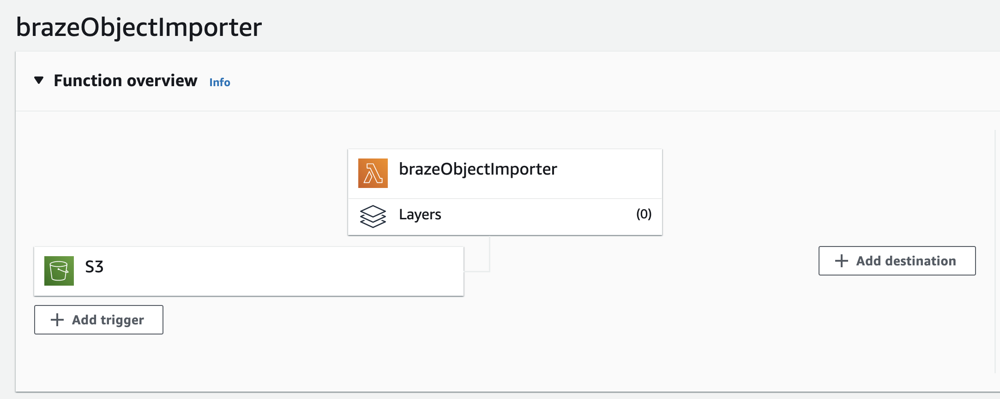

# Braze Custom Events and Purchases Import

This AWS Lambda application takes a JSON file containing user custom events and purchases from an S3 bucket and imports it to the Braze platform using the [/user/track](https://www.braze.com/docs/api/endpoints/user_data/post_user_track/) REST endpoint. Once the file is uploaded to the specified bucket, the Lambda will start streaming the file, parsing objects and sending data to Braze in batches.

There are no limits on the file size or the amount of objects. Each function is configured to run for up to 12 minutes and if the file is not done processing, it will invoke a new function to start parsing it from the last object it read. There are automatic retries with exponential backoff in case of network or server errors.

### Requirements

To successfully use the Lambda function you must have:

1. AWS Account
2. Braze [REST API key and URL](https://www.braze.com/docs/api/basics/)
3. JSON file containing an array of objects

### Events and Purchases

The JSON file format must either be an array of objects, or an AWS export JSON file format with one JSON object per line.

Array of objects

    [
      {
        "external_id" : "user1",
        "name" : "rented_movie",
        "time" : "2013-07-16T19:20:45+01:00",
        "properties": {
          "movie": "The Sad Egg",
          "director": "Dan Alexander"
        }
      },
      {
        "external_id" : "user1",
        "product_id" : "Completed Order",
        "currency" : "USD",
        "price" : 219.98,
        "time" : "2013-07-16T19:20:30+01:00",
        "properties" : {
            "products" : [{ "name": "Monitor", "category": "Gaming", "product_amount": 19.99 }]
        }
      }
    ]

One object per line (eg. Redshift `unload` operation)

    {"external_id":"user1","name":"rented_movie","time":"2013-07-16T19:20:45+01:00","properties":{"movie":"The Sad Egg","director":"Dan Alexander"}}
    {"external_id":"user1","product_id":"Completed Order","currency":"USD","price":219.98,"time":"2013-07-16T19:20:30+01:00","properties":{"products":[{"name":"Monitor","category":"Gaming","product_amount":19.99}]}}

Learn more about the specific format required by each object:

- Events: https://www.braze.com/docs/api/objects_filters/event_object/
- Purchases: https://www.braze.com/docs/api/objects_filters/purchase_object/

## Deploy the Function

In order to use the function, you must have an S3 bucket to upload the files and an IAM role that allows the function to read the file.

#### 1. Create an S3 Bucket

Navigate to the S3 service in the AWS console and create a new bucket. You can keep all the default settings.

If you already have a bucket you're uploading files to, you can skip this step.

#### 2. Deploy the Lambda function

Navigate to the Lambda service in the AWS console. Create a new function by pressing the `Create function` button in the upper right corner. Provide a name for the function such as _brazeObjectImporter_, choose **Python 3.9** runtime and create the function.

From [releases](https://github.com/braze-inc/growth-shares-lambda-events-purchases-import/releases), download the latest packaged `.zip` function and import it into Lambda by clicking `Upload from` under the Code tab and selecting the downloaded archive.

It is time to configure the importer.

In the Lambda function, navigate to the Configuration tab. Under Permissions, click on the role.
<kbd></kbd>

##### IAM

Attach new policies by clicking on **Add Permissions** and **Attach Policies**. Here we want to search and add:

1. `AWSLambdaRole` - which allows the function to invoke a new function to keep processing a large file
2. `AmazonS3ReadOnlyAccess` - which allows us to read from the bucket

The resulting role should look like this:
<kbd></kbd>

##### Braze Connection

Back in the Lambda function configuration, select Environment Variables. Add two new variables:

1. `BRAZE_API_KEY` - REST API key which you can configure under the [**Developer Settings**](https://www.braze.com/docs/api/basics/#rest-api-key) in the Braze dashboard  
   :warning: The API key must have a `user.track` permission
2. `BRAZE_API_URL` - REST API endpoint which corresponds to your dashboard instance, you can find the correct URL in this [table](https://www.braze.com/docs/api/basics/#api-definitions)

##### Configuration

Navigate to **General configuration** under Configuration and edit the general configuration.

1. Increase memory to 2048MB
   > More memory allows you to use more threads to send requests, which speeds up the process but costs slightly more money. If you would like to use less memory, check out the Customization guide below.
2. Increase timeout to 15 min and 0 sec.

<kbd></kbd>

##### Connect the bucket

As a final step, we connect the function to start processing the file whenever it is uploaded to the bucket.

In the main function window, click on `+ Add trigger`. Search and select _S3_ in the list. Select which bucket you want to read from. Add the trigger. The resulting setup should look like this:
<kbd></kbd>

:tada: You're ready to start sending custom events and purchases to Braze!
